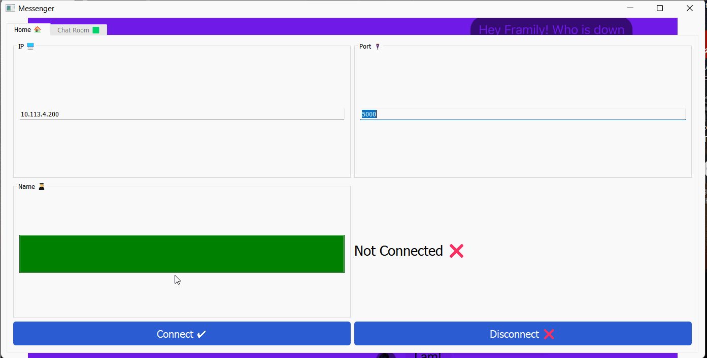
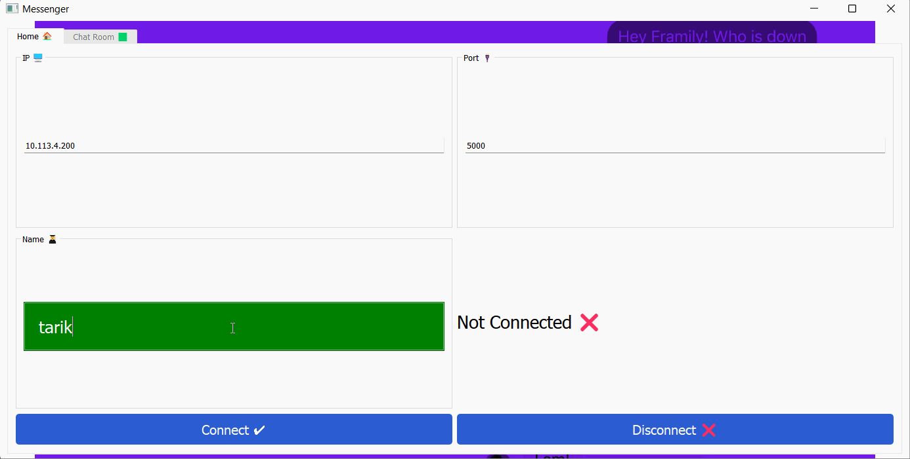
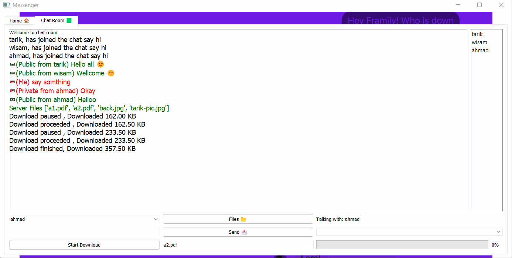

# Messgeger App & Reliable UDP File Transfer  

#### A part of a university assignment

 

## Project Overview

Chat app with client and server ,That supports downloading files from server using a custom Reliable UDP ,
Implementing some of RDT concepts 

 

## How To Run

`From the terminal : First run the server then the client`

    python client , python server

 

## How To Use The GUI

 

## What has been done ?

- ### Reliable UDP

    - Go-Back-N algorithm
    - Congestion control , slow start (cwnd = 1 , ssthresh = 8)
    - Flow control
    - Cumulative Acknowledgements and Sequence Numbers
    - Utilization and Window Size
    - Timeout event
    - Duplicate ACK's Event
    - Close connection - (FIN,FINACK)
    - Exponential wegihted moving average , (timeout RTT)
    - Error detection - check sum

- ### GUI & Overall Functionalty

  - Connect / Disconnect from the server (over TCP)
  - Send Private / Public messages (over TCP)
  - Get server files list (over TCP)
  - Get online users (over TCP)
  - Download files from the server (over Reliable UDP)
  - Updating online users
  - Download progress 
  - Pause download 
  - Select user to send private message
    

- ### Json
  - Data transfer was accomplished using json format

 

## Authors

* **Tarik Husin**  - linkedin -> https://www.linkedin.com/in/tarik-husin-706754184/
* **Wissam Kabha**  - github -> https://github.com/Wissam111

 

## References
https://www.baeldung.com/cs/networking-go-back-n-protocol

https://www.sciencedirect.com/topics/computer-science/go-back-n